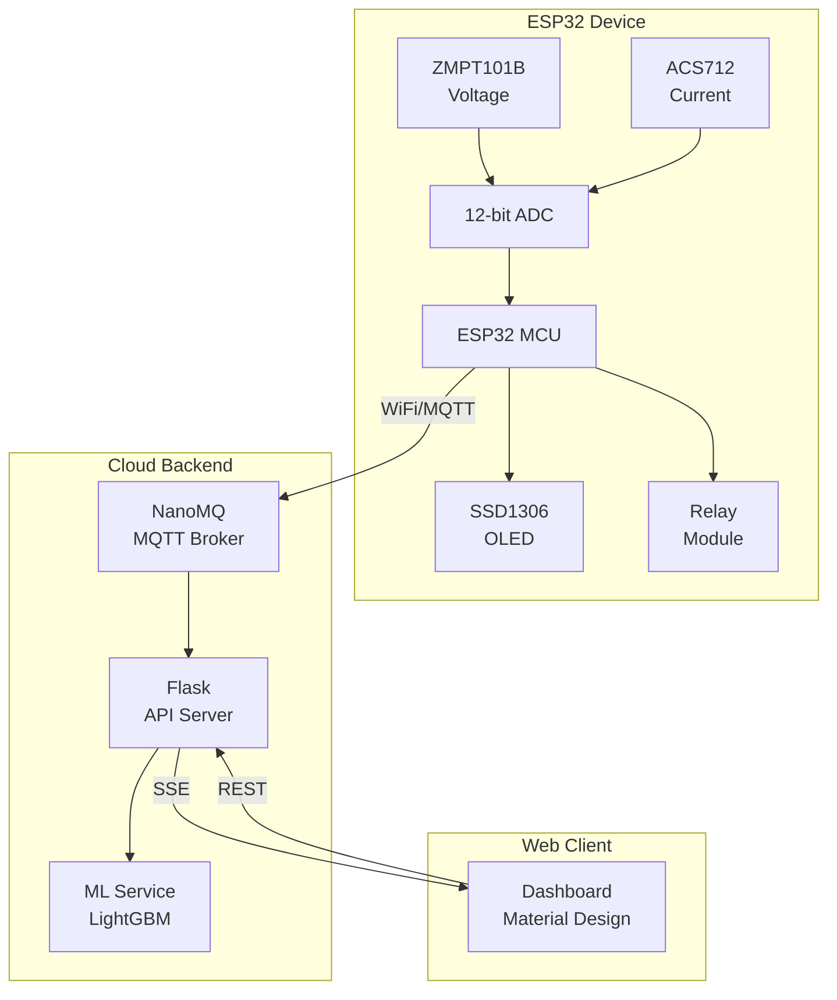
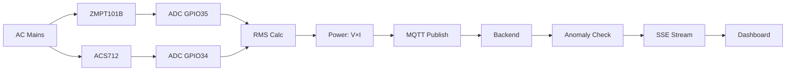
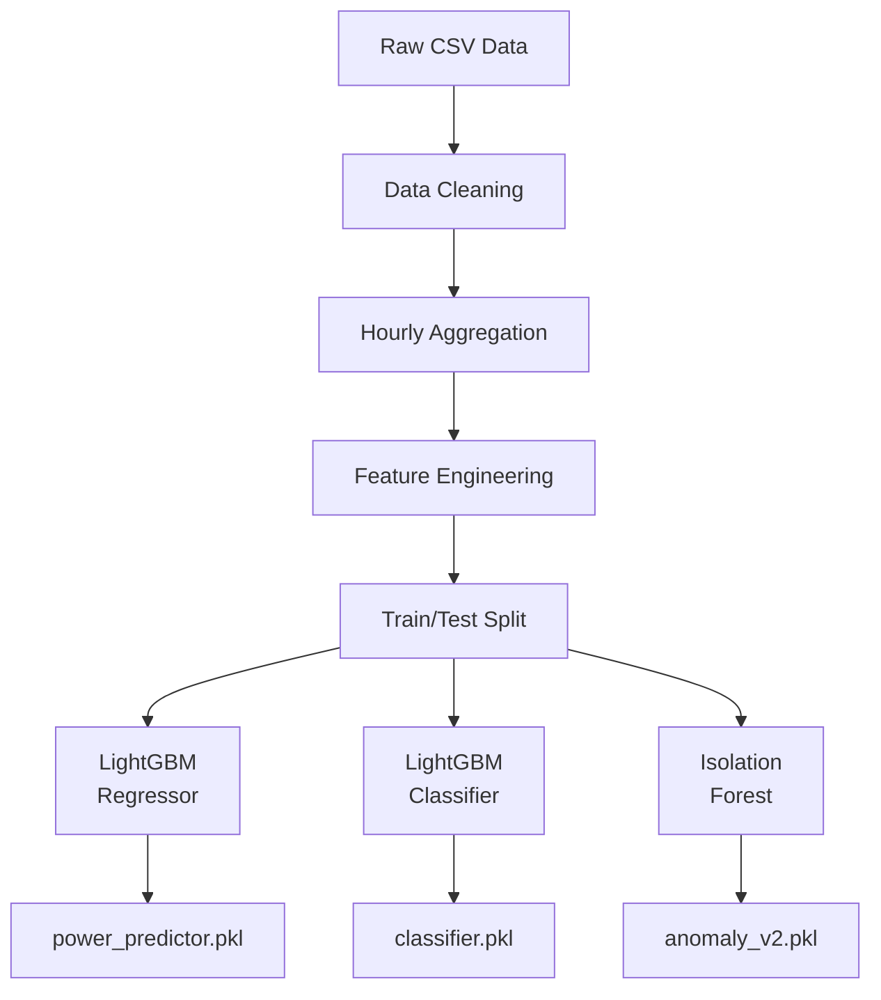

# Diagrams

This folder contains Mermaid diagram source files that can be rendered in GitHub, VS Code, or any Mermaid-compatible viewer.

## Files

| File | Description |
|------|-------------|
| `system-architecture.mmd` | High-level system architecture |
| `data-flow.mmd` | Data flow through the system |
| `ml-pipeline.mmd` | Machine learning pipeline |
| `device-state-machine.mmd` | ESP32 firmware state machine |
| `sequence-diagram.mmd` | Component interaction sequence |

## Viewing Diagrams

### GitHub
Mermaid diagrams render automatically in `.md` files on GitHub.

### VS Code
Install the "Markdown Preview Mermaid Support" extension.

### Online
Use https://mermaid.live to paste and render diagrams.

---

## Quick Preview

### System Architecture

### Data Flow

### ML Pipeline

